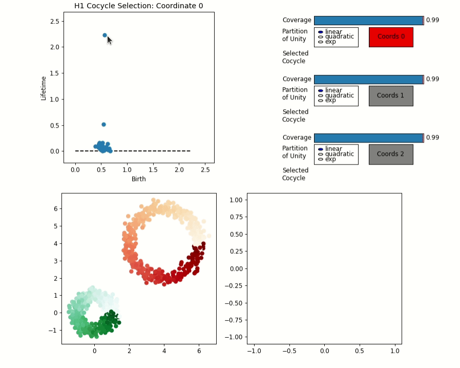
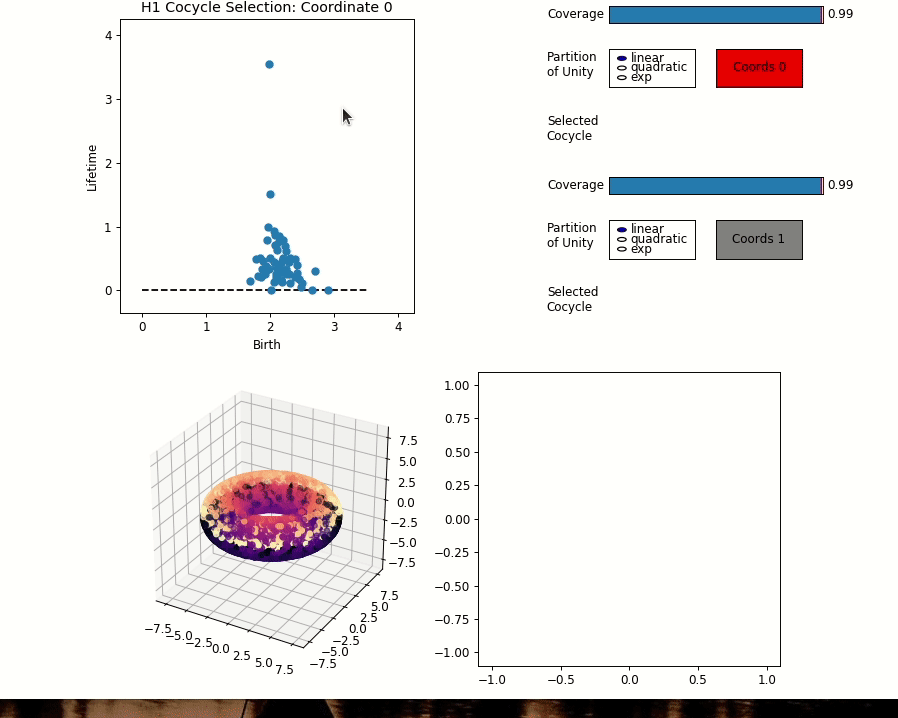

# Image Analysis 
This is a clone of Jose Perea's DREiMac Tool that was used to analyse spaces of
image patches. 
My own work can be found in the ImageAnalysis folder and the numbered notebooks
are the interesting ones, unnumbered are tryouts/unfinished work and under heavy
construction.

TODO:
- Figure out the manifold for the fourier space. My hypothesis is that it lies
  in RP^1 x C^2
- Understand how the paper used the klein bottle structure and how the above
  manifold yields better results. 
- It would be very interesting to see how scaling / rotation works in the above
  as it would in fact be a quotient space of the above manifold. Same with
  scaling. This means that "just" projecting on the smaller space and using that
  for the NN would guarantee rotation/scale invariance out of the box. At what
  cost?
- Investigate if Perea's approach, mapping the patches to the above manifold and
  viewing it as a distribution, estimating fourier coeff's of the distribution
  and classifying those might be a better alternative. 
- Understand if there is a natural way to visualise the phase of the fft, and if
  the effect is important or whether just using the amplitude might be
  sufficient. (or vice versa, this might be even better)
- 

# DREiMac
## Dimension Reduction with Eilenberg-MacLane Coordinates
### Chris Tralie, Tom Mease, Jose Perea

DREiMac is a library for topological data coordinatization, visualization and dimensionality reduction. 
It leverages [Eilenberg-MacLane spaces](https://en.wikipedia.org/wiki/Eilenberg%E2%80%93MacLane_space#Bijection_between_homotopy_classes_of_maps_and_cohomology), and turns persistent cohomology computations 
into topology-preserving coordinates for data.

TO USE: interactively select persistent cohomlogy classes,  parameters, and DREiMac will compute maps from the data to appropriate (low-dimensional skeleta of Eilenberg-MacLane) spaces consistent with the underlying data topology.

# Python version

Code can be found in dreimac/.  If you're using conda and would like to create a virtual environment first, type
~~~~~ bash
conda create -n dreimac python=3.8.3
conda activate dreimac
~~~~~

Then, to install, type
~~~~~ bash
git clone https://github.com/ctralie/DREiMac.git
cd DREiMac
pip install cython
pip install -r requirements.txt
python setup.py install
~~~~~

Then, you can import dreimac from any python file or notebook.  For example, if you type the following from the root of the repository
~~~~~ bash
cd notebooks
jupyter notebook
~~~~~

then you will be able to interactively explore the notebooks we have setup

## Two Circles Example

Below is an example showing the interactive circular coordinates interface on a data set comprised of two noisy circles in 2D

## Torus Example

Below is an example showing the interactive circular coordinates interface on a 3D point cloud of a torus

# Javascript version

Code can be found in dreimacjs/
CircluarCoords.html and ripser.html are the entry points

## Emscripten Compile options

~~~~~ bash
emcc --bind -s ALLOW_MEMORY_GROWTH=1 -O3 ripser.cpp
~~~~~

## MIME Types
* MIME Types for Javascript files should be text/javascript
* MIME Types for wasm files should be application/wasm
